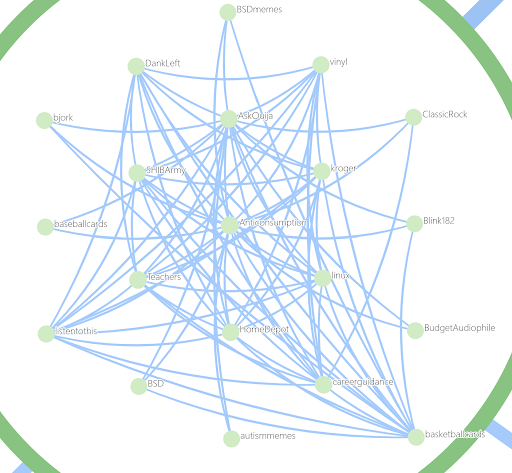
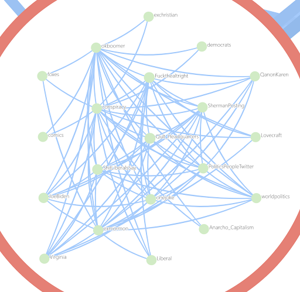
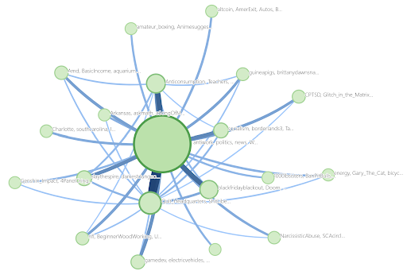
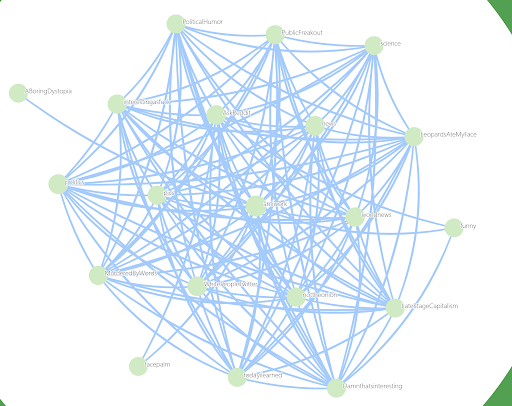

# RedditGraph

This project is designed to analyze Reddit comments made by authors across different subreddits within a specified time frame. It focuses on calculating the total score of comments per subreddit for each author, identifying the top subreddits based on these scores, and aggregating their activity across other subreddits. The final data is saved to a CSV file for further analysis or visualization.

## Features

- **Data Collection**: Fetches comments made by specific authors from Reddit using the Pushshift API.
- **Error Handling**: Implements error handling to manage potential issues during data fetching, including retries.
- **Data Aggregation**: Calculates the total score of comments per subreddit for each author and identifies top subreddits based on these scores.
- **Data Analysis**: Aggregates activity across subreddits for top authors and saves this data for further analysis.
- **CSV Output**: Outputs the aggregated data into a CSV file, making it easy to share and analyze using other tools.

## Getting Started

### Prerequisites

- R programming environment (RStudio recommended).
- Required R packages: `tidyverse`, `jsonlite`. Install these packages using `install.packages("package_name")`.

### Installation

1. Clone this repository or download the source code to your local machine.
2. Ensure you have the required R packages installed.

### Usage

1. Modify the `get_subs` function call within the script to specify the author and time frame you're interested in analyzing.
2. Run the script. It will automatically fetch, process, and save the data to a CSV file named `subreddit_data.csv`.
3. Open `subreddit_data.csv` with your preferred CSV tool to analyze the data.

## Network Visualizations

Below are visualizations of the Reddit comment network, showcasing the relationships and activity across different subreddits.

## Contributing

Contributions to this project are welcome. Whether it's adding new features, improving the documentation, or reporting bugs, please feel free to fork the repository and submit a pull request.

## License

This project is open source and available under the MIT License. 

## Acknowledgments

- The Pushshift API for providing access to Reddit data.
- The R community for the development of the `tidyverse` and `jsonlite` packages, which made this project possible.
